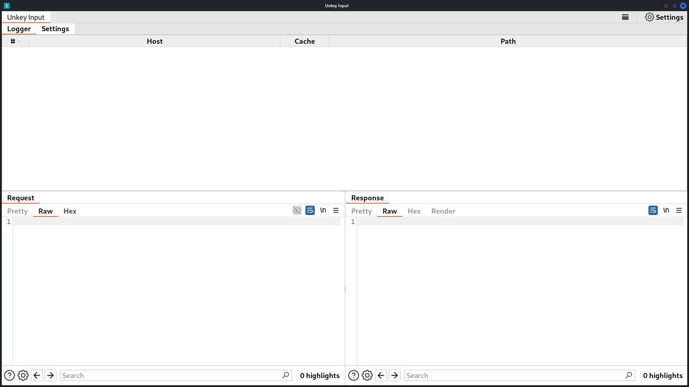
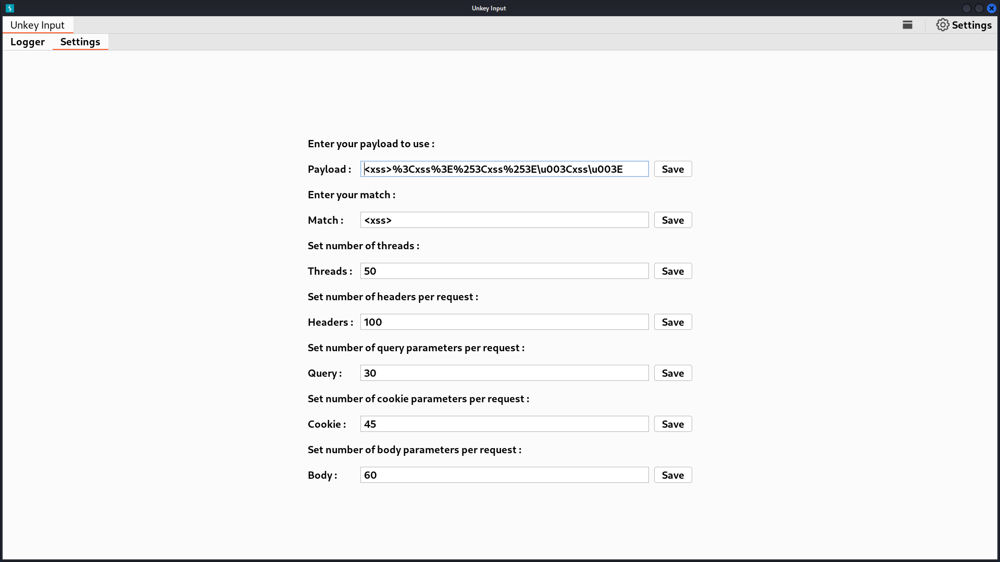
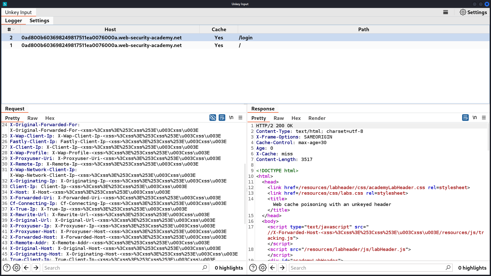

<h1 align="center">Unkey Input</h1>

<h4 align="center">Burp suite extension to find unkey headers OR parameters</h4>


<h3 align="center">
  <table>
    <tr>
      <td></td>
      <td></td>
    </tr>
  </table>
</h3>

<h3 align="center">
    
</h3>


<h1 align="center">Features</h1>


<h4>1 - Unique cache key per every request </h4>

  <ul>
    <li>Random _parameter , _Cookie and User-Agent</li>
    <li>Remove If-Modified-Since and If-None-Match</li>
   </ul>


<h4>2 - add top HTTP headers to your incoming HTTP requests</h4>

```sh
GET /?_parameter=372586408566 HTTP/1.1
Host: 0ad800b603698249817511ea0076000a.web-security-academy.net
User-Agent: Mozilla/5.0 (Windows NT 10.0; Win64; x64) AppleWebKit/537.36 (KHTML, like Gecko) Chrome/372586408566 Safari/372586408566
Cookie: _Cookie=372586408566
Pragma: akamai-x-check-cacheable,akamai-x-cache-on
Fastly-Debug: 1
X-Http-Forwarded-For: X-Http-Forwarded-For-<xss>%3Cxss%3E%253Cxss%253E\u003Cxss\u003E
X-Forwarded-For-Original: X-Forwarded-For-Original-<xss>%3Cxss%3E%253Cxss%253E\u003Cxss\u003E
X-Forwarded-Client-Ip: X-Forwarded-Client-Ip-<xss>%3Cxss%3E%253Cxss%253E\u003Cxss\u003E
X-Cluster-Client-Ip: X-Cluster-Client-Ip-<xss>%3Cxss%3E%253Cxss%253E\u003Cxss\u003E
X-Original-Forwarded-For: X-Original-Forwarded-For-<xss>%3Cxss%3E%253Cxss%253E\u003Cxss\u003E
X-Wap-Client-Ip: X-Wap-Client-Ip-<xss>%3Cxss%3E%253Cxss%253E\u003Cxss\u003E
Fastly-Client-Ip: Fastly-Client-Ip-<xss>%3Cxss%3E%253Cxss%253E\u003Cxss\u003E
X-Client-Ip: X-Client-Ip-<xss>%3Cxss%3E%253Cxss%253E\u003Cxss\u003E
X-Wap-Profile: X-Wap-Profile-<xss>%3Cxss%3E%253Cxss%253E\u003Cxss\u003E
X-Proxyuser-Uri: X-Proxyuser-Uri-<xss>%3Cxss%3E%253Cxss%253E\u003Cxss\u003E
X-Remote-Ip: X-Remote-Ip-<xss>%3Cxss%3E%253Cxss%253E\u003Cxss\u003E
X-Wap-Network-Client-Ip: X-Wap-Network-Client-Ip-<xss>%3Cxss%3E%253Cxss%253E\u003Cxss\u003E
X-Originating-Ip: X-Originating-Ip-<xss>%3Cxss%3E%253Cxss%253E\u003Cxss\u003E
Client-Ip: Client-Ip-<xss>%3Cxss%3E%253Cxss%253E\u003Cxss\u003E
X-Host: X-Host-<xss>%3Cxss%3E%253Cxss%253E\u003Cxss\u003E
X-Forwarded-Uri: X-Forwarded-Uri-<xss>%3Cxss%3E%253Cxss%253E\u003Cxss\u003E
Cf-Connecting-Ip: Cf-Connecting-Ip-<xss>%3Cxss%3E%253Cxss%253E\u003Cxss\u003E
X-True-Ip: X-True-Ip-<xss>%3Cxss%3E%253Cxss%253E\u003Cxss\u003E
X-Rewrite-Url: X-Rewrite-Url-<xss>%3Cxss%3E%253Cxss%253E\u003Cxss\u003E
X-Original-Url: X-Original-Url-<xss>%3Cxss%3E%253Cxss%253E\u003Cxss\u003E
X-Proxyuser-Ip: X-Proxyuser-Ip-<xss>%3Cxss%3E%253Cxss%253E\u003Cxss\u003E
X-Proxyuser-Host: X-Proxyuser-Host-<xss>%3Cxss%3E%253Cxss%253E\u003Cxss\u003E
Referer: Referer-<xss>%3Cxss%3E%253Cxss%253E\u003Cxss\u003E
X-Forwarded-Host: X-Forwarded-Host-<xss>%3Cxss%3E%253Cxss%253E\u003Cxss\u003E
X-Remote-Addr: X-Remote-Addr-<xss>%3Cxss%3E%253Cxss%253E\u003Cxss\u003E
X-Original-Host: X-Original-Host-<xss>%3Cxss%3E%253Cxss%253E\u003Cxss\u003E
X-Originating-Host: X-Originating-Host-<xss>%3Cxss%3E%253Cxss%253E\u003Cxss\u003E
True-Client-Ip: True-Client-Ip-<xss>%3Cxss%3E%253Cxss%253E\u003Cxss\u003E
X-Real-Host: X-Real-Host-<xss>%3Cxss%3E%253Cxss%253E\u003Cxss\u003E
Akamai-Client-Ip: Akamai-Client-Ip-<xss>%3Cxss%3E%253Cxss%253E\u003Cxss\u003E
X-Forwarded-Path: X-Forwarded-Path-<xss>%3Cxss%3E%253Cxss%253E\u003Cxss\u003E
X-Original-Cookie: X-Original-Cookie-<xss>%3Cxss%3E%253Cxss%253E\u003Cxss\u003E
X-Forwarded-By: X-Forwarded-By-<xss>%3Cxss%3E%253Cxss%253E\u003Cxss\u003E
Forwarded: Forwarded-<xss>%3Cxss%3E%253Cxss%253E\u003Cxss\u003E
X-Forwarded-For: X-Forwarded-For-<xss>%3Cxss%3E%253Cxss%253E\u003Cxss\u003E
X-Original-User-Agent: X-Original-User-Agent-<xss>%3Cxss%3E%253Cxss%253E\u003Cxss\u003E
X-Real-Ip: X-Real-Ip-<xss>%3Cxss%3E%253Cxss%253E\u003Cxss\u003E
X-Forwarded-Server: X-Forwarded-Server-<xss>%3Cxss%3E%253Cxss%253E\u003Cxss\u003E
X-Original-Referer: X-Original-Referer-<xss>%3Cxss%3E%253Cxss%253E\u003Cxss\u003E
```

<h4>3 - Contain context menu to fuzz </h4>
<ul>
  <li>TitleCase Headers</li>
  <li>LowerCase Headers</li>
  <li>UpperCase Headers</li>
  <li>Hyphen to Underscore</li>
  <li>Duplicate Headers</li>
  <li>Hex to Headers</li>
  <ul>
    <li>Hex Before Headers</li>
    <li>Hex After Headers</li>
   </ul>
  <li>Duplicate Header With Space</li>
  <li>Fuzz Parameters</li>
  <ul>
    <li>Query</li>
    <li>Body</li>
   </ul>
  <li>Fuzz Cookie</li>
</ul>

<h1 align="center">Reference</h1>
<p align="center">
  <a href="https://medium.com/@0xAwali/beyond-web-caching-vulnerabilities-c617d8cdbb85">Beyond Web Caching Vulnerabilities</a>
</p>

<h1 align="center">© Copyright</h1>

<p align="center">
<a href="https://twitter.com/0xAwali"></a>
</p>
